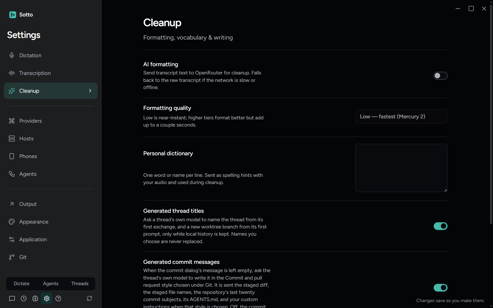
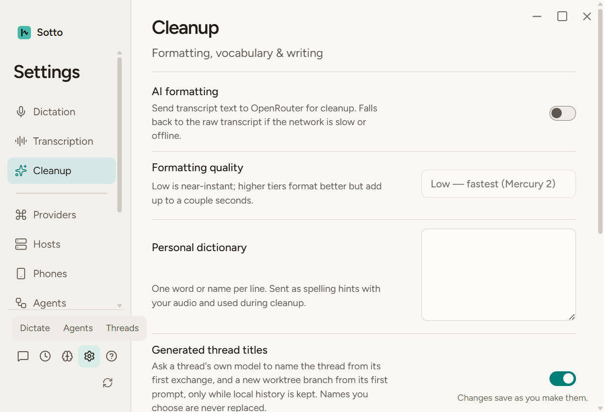

# Dictionary save acknowledgements (#382)

Base: `2a3bcbb6`. Settings now matches each dictionary acknowledgement to the submitted edit revision. Newer typing survives earlier acknowledgements, including several queued blur/refocus cycles. A failed save retains the current text for the next blur. External dictionary updates remain authoritative, and returning to the previous value still queues a save when a different value is already pending. No field layout, copy, parsing, validation limit or keyboard behavior changed.

The desired-behavior renderer regression first failed four cases on the unchanged baseline. Nine final cases exercise both acknowledgement/result orders, queued saves, queued reverts, rejected and failed saves, external settings publications, normal multiline keyboard blur and unchanged-value suppression. The existing settings and neighboring suites passed 97 tests across four files (34.05 seconds). These are operation and state assertions, not timing benchmarks. Typing only updates local state and its edit revision; writes occur on blur, and another blur without an edit does not duplicate the pending save.

The real built Electron journey `tests/e2e/settings-index.spec.ts` passed again after integrating main at `d6db0dac` (one test, 31.3 seconds). It exercises ten Settings categories, dictionary persistence after reload, save failure feedback, focus and keyboard navigation, light/dark appearance at 1600 by 1000, 1280 by 800 and 820 by 560, and reduced motion. The current Phones category is present in the sidebar; its own surface is outside this dictionary journey. Runtime preparation and build passed. The unrelated generated runtime files and existing design captures were restored afterward; no design baselines changed.

The Cleanup captures below were visually inspected: dictionary label, description and textarea remain readable and reachable at the typical and minimum sizes. The retained screenshots contain synthetic settings only.

After integration, the same four renderer suites passed 97 tests (72.46 seconds). Typecheck, full lint, notices verification and build passed. Independent native Astra Standards and Spec reviews and the integration review found no material findings. The protected full two-worker suite at `9a10b9a5` passed 445 files and 5,849 tests, with 39 files and 140 tests skipped (958.90 seconds). `SOTTO_PERF_DATA` pointed to a verified-absent owned path and live provider flags were unset. An earlier interrupted run has no completion receipt and is not claimed as passing. Delayed acknowledgements and storage rejection are controlled renderer tests; the Electron journey exercises normal persistence and existing failure surfaces. No paid transcription or provider calls were made, and macOS was not exercised. The pre-existing narrow sidebar mode-row overflow remains separately tracked in #388; the dictionary field itself fits.

Final integration includes main `3cb36d8d` and its missing-image repair. The only manual resolution preserved both artifact-ignore entries; dictionary production and regression sources did not change. The integrated PR's full CI gate remains pending.
