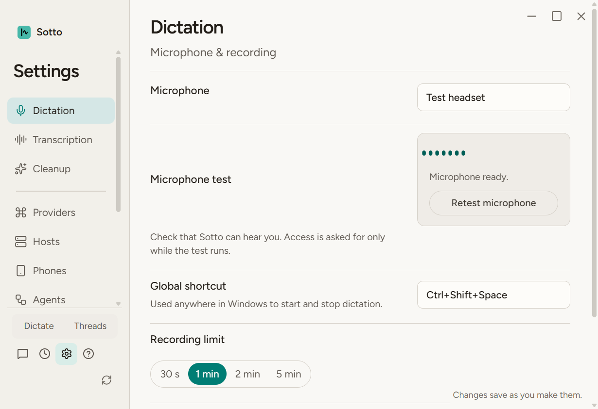
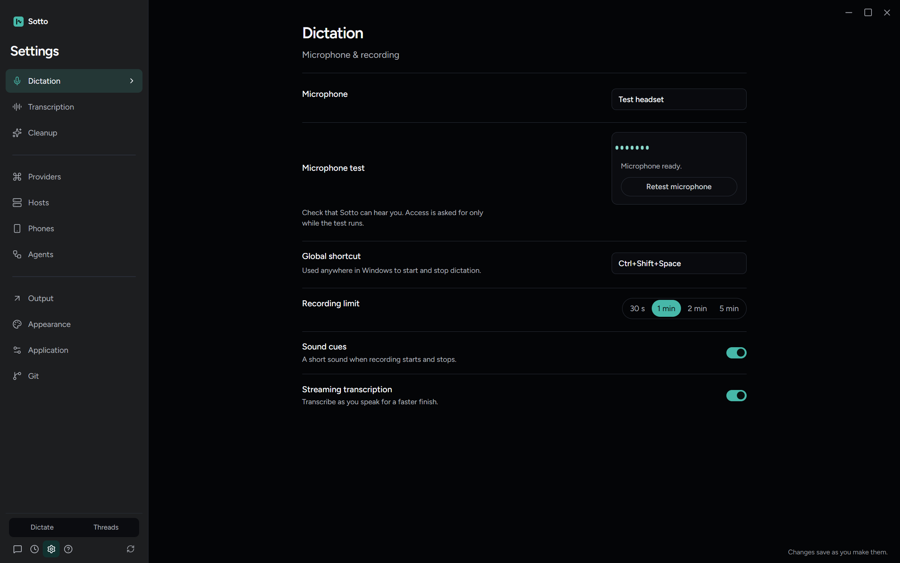

# Test the selected microphone (#383)

Settings and onboarding now pass the saved dictation input to the microphone test. The test and recorder share the same constraints, including an exact device ID for a selected input. A missing selected device remains missing; it never falls back to the default. Changing the Settings selection clears the old state and meter, stops its stream and invalidates late permission results. Controls and copy are unchanged.

Three desired-behavior regressions failed on the baseline: exact selected constraints, Settings forwarding and clearing the old ready result. After the fix the recorder, microphone and Settings suites passed 110 tests. The saved-onboarding selection follow-up and neighboring App/microphone lifecycle suites passed 47 tests. Missing/denied cases require one exact-device request, and cancelled late streams stop their tracks.

The final implementation includes the newly merged Phones category. Typecheck, lint, notices and build passed. `npx playwright test tests/e2e/selected-microphone.spec.ts --workers=1` passed one test in 7.0 seconds on that integrated build. It drives real Settings, `BrowserMicrophoneTest`, AudioContext and MediaStreams, with synthetic device discovery and permission results. It checks selected/default/missing/denied outcomes, selection while permission is pending, late-stream cleanup and cleanup when leaving Settings. It captures light/dark at 1600 by 1000, 1280 by 800 and 820 by 560 with reduced motion. No paid calls or physical microphone access were used.

The retained final captures were visually inspected. The selected input, status and Retest button remain readable and reachable at the minimum width. No design baselines changed.

Independent native Astra Standards and Spec reviews of the initial frozen implementation reported zero material findings. Root review requested import placement cleanup and checking saved input during onboarding; both are addressed. Independent final delta Standards/Spec review at `cf81ec07` also reported zero findings, and the root review agrees. The frozen full suite at `a444ef13` passed 5,862 tests with 140 skipped (447 files passed, 39 skipped; 913.62 seconds). It used two workers, a verified-absent owned `SOTTO_PERF_DATA` path, unset live flags and no diagnostic artifact tests. Final integration `cb80c68d` includes the reviewed shared artifact-ignore commit `6d5c12ea`; the microphone renderer and tests are unchanged. Current typecheck, lint and notices passed, followed by 108 Settings, microphone and App tests (35.42 seconds). Reviewed SSH readiness #422 remains an explicit dependency until its PR merges. This is synthetic-media verification, not a physical-headset or macOS test.
