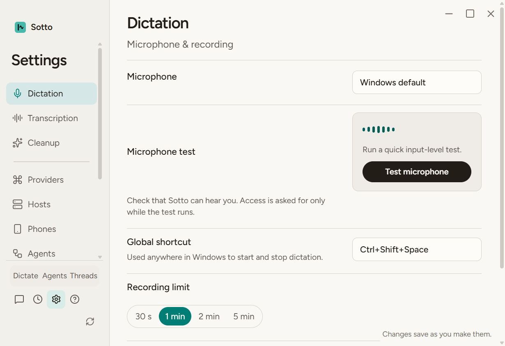
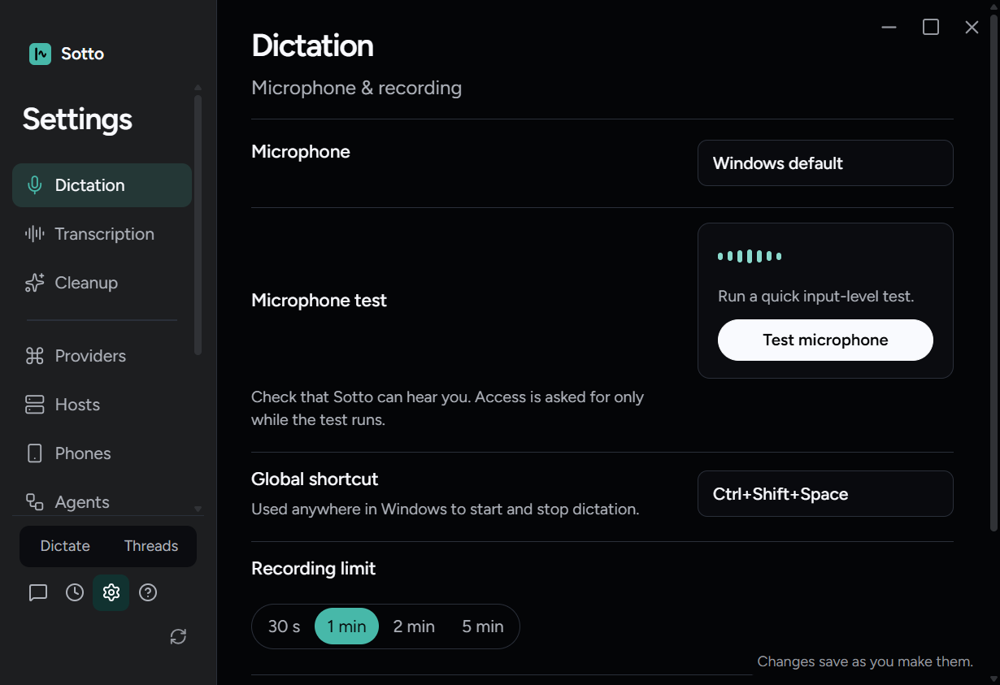
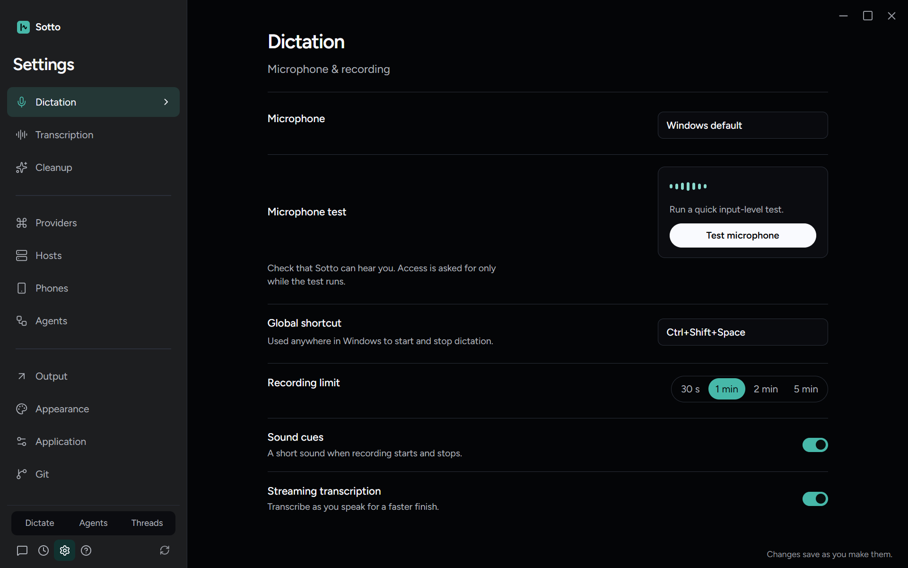

# Fit the Settings room switch (#388)

Zach selected prototype A: keep the horizontal row and existing sidebar width, fitting both the two-room beta default and three-room voice-enabled state. The primary source is `prototype/code-base-review-workflows` at `58917d59`, with the choice and both-state clarification recorded on issue #388. Production uses equal adaptive columns and removes only button side padding in the Settings sidebar. The 12.5px label size, names, theme roles and keyboard handlers are unchanged.

The real Electron regression failed on the unchanged layout at 820 by 560: sidebar right 178px, row right 199.385px. After the two scoped CSS rules, `npx playwright test tests/e2e/settings-mode-row.spec.ts --workers=1` passed both gate states in 9.7 seconds. It checks every footer control stays within the sidebar and viewport, each label fits its button at the original font size, widths are equal, and keyboard End/ArrowRight activate the expected room. Destination selection is asserted after navigation remounts the page; the first test draft incorrectly expected the old element's focus to survive that existing remount.

Both gate states were checked in light/dark with reduced motion at 1600 by 1000, 1280 by 800 and 820 by 560. The final build includes the Phones Settings category. The geometry reports remain in ignored `artifacts/review-388/geometry-*.json`. All three sidebar/theme neighboring suites passed 52 tests. The captures below were visually inspected; labels fit without clipping at the minimum and retain the existing hierarchy at typical size. No unrelated design baselines changed.

Static gates, full two-worker suite and independent Standards/Spec review remain pending. No paid providers, production profile or physical microphone were used; macOS was not exercised.
